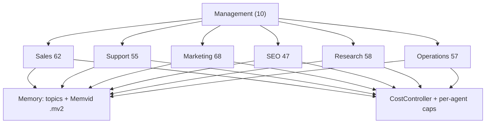

<p align="center">
  
</p>

# TechTide Swarm 357

[](https://pypi.org/project/techtide-swarm/)
[](https://github.com/TechTideOhio/swarm-357/actions/workflows/ci-standalone.yml)
[](https://pypi.org/project/techtide-swarm/)
[](LICENSE)

Layered agent orchestration for business automation — **357** Claude AI agent roles across **6** business layers, backed by portable Memvid memory and honest cost controls.

<p align="center">
  
</p>



## Install

```bash
pip install techtide-swarm
swarm demo
```

From this repo (editable + tests):

```bash
pip install -e "packages/techtide-swarm[dev]"
swarm demo
```

`swarm demo` works with or without an API key — architecture overview + stub without a key; live agent when `ANTHROPIC_API_KEY` (or OpenRouter) is set.

## About

Swarm 357 is an **organizational ontology for agents**, not a claim that 357 Opus sessions run in parallel. Each role is a YAML identity + soul template (for example `sales-outreach-specialist-015`). The Conductor routes work; layer execution uses bounded concurrency. Cost, memory, and bash policy are first-class — the same things that break demos in production.

Built by [TechTide AI](https://techtide.ai) for Claude Code–native workflows. Source: [TechTideOhio/swarm-357](https://github.com/TechTideOhio/swarm-357).

## What "357 agents" means

**357 agents** means **357 distinct agent identities** (YAML roster + soul templates), materialized at runtime. It is **not** 357 simultaneous long-running LLM sessions. Objective checks: [docs/VERIFY.md](docs/VERIFY.md) and `python scripts/generate_roster.py --compact --fix-counts`.

## Evals

Numbers below come from [`evals/baselines/latest.json`](evals/baselines/latest.json) via [`scripts/render_eval_assets.py`](scripts/render_eval_assets.py). Full write-up: [docs/EVALS.md](docs/EVALS.md).


| Metric | Value |
|--------|------:|
| Catalog | 25 tasks (20 single, 5 swarm) |
| Executions (incl. burns) | 154 |
| Passed gates | 145 |
| Avg combined score | 0.923 |
| Spend | $4.9915 / $5.00 |
| Provider | `openrouter` |
| Agent model | `anthropic/claude-sonnet-4` |
| Single-agent pass | 141/142 |
| Swarm pass | 4/12 |

**Caveat:** swarm pipeline runs can hit 150–180s wall-clock timeouts on OpenRouter. Single-agent + tools is the production demo path. Scoring: keyword gate + optional Haiku judge (`0.55·kw + 0.45·llm`), hard `$5` budget, checkpoint/resume, regression compare.

```bash
python -u evals/run_evals.py --budget 5.0 --save-baseline --compare
# or
swarm eval --save-baseline --compare
```

## What This Does

- **`swarm run <task>`** — Conductor selects roles across layers; shows real cost and latency.
- **`swarm boot`** — Loads the 357-agent roster, validates souls, prints layer budgets.
- **`swarm agent --list`** — List agents; `swarm agent <name> --run "task"` for one.
- **`swarm dream`** — Memory consolidation (contradictions / duplicates; optional LLM notes).
- **`swarm plan <task>`** — Deep planning via Opus-class models.
- **`swarm eval`** — 25-task catalog with LLM judge, `$5` cap, baseline regression.
- **`swarm status`** / **`swarm cost`** — Layer health and cost from local telemetry.
- **`swarm serve`** — FastAPI HTTP surface for the landing console.

## Request lifecycle


## Architecture

| Component | Location | What it does |
|-----------|----------|-------------|
| Python package | [`packages/techtide-swarm/`](packages/techtide-swarm/) | `Agent`, `Swarm`, `CostController`, `MemoryManager`, `BashSecurityGate`, CLI, HTTP API |
| Memvid bridge (Rust) | [`packages/memvid-swarm-bridge/`](packages/memvid-swarm-bridge/) | CLI binary for `.mv2` create/put/search/verify |
| Agent roster | [`config/swarm-compact.yaml`](config/swarm-compact.yaml) | Compact 357-agent expansion (also bundled in the wheel) |
| Soul templates | [`templates/soul/`](templates/soul/) | Personality files with YAML front-matter + system prompts |
| Eval harness | [`evals/`](evals/) | 25-task benchmark, LLM judge, baselines |
| Landing page | [`.ui_landin_sample/minimal/`](.ui_landin_sample/minimal/) | Next.js 16 product surface + `/about` |
| Memvid core (vendored) | [`.repos and items/memvid-main/`](.repos%20and%20items/memvid-main/) | Upstream Rust library referenced by the bridge |

## Key Differentiators

**Portable .mv2 memory** — Single-file Memvid stores with WAL crash safety, full-text + vector search, integrity verification. No database server required.

**Business-layer ontology** — Six domain layers + management meta-agents model a real org chart, not ad-hoc agent graphs.

**Layered cost controls** — Per-agent budget caps during `Agent.run()`, per-layer daily limits, automatic model downgrade at 80% utilization.

**BashSecurityGate** — 13-pattern regex validator on the `Bash` tool. Blocks destructive commands and secret exfiltration. 50+ tests.

**Tool-call resilience** — `input_normalize` coerces common LLM argument aliases (`file_path` → `path`, etc.) so demos do not die on schema drift.

## Feature Maturity

See [STATUS.md](STATUS.md). Summary:

| Feature | Status |
|---------|--------|
| Agent + Swarm orchestration | Beta |
| CLI | Stable/Beta |
| Memory (flat-file + Memvid) | Beta |
| BashSecurityGate | Stable |
| Cost controls | Beta |
| Eval harness | Beta |
| HTTP API | Beta |
| Dream cycle | Alpha |

## Why Not [X]?

| Framework | Swarm 357 advantage | Their advantage |
|-----------|--------------------|--------------------|
| LangGraph | Portable `.mv2` memory; business-layer ontology; cost gates | Durable checkpointing; larger ecosystem |
| CrewAI | Enforced cost controls; security gate; layered architecture | Faster time-to-first-value; YAML crew config |
| OpenAI Agents SDK | Multi-agent orchestration; memory persistence | Input/output guardrails; simpler API surface |

Longer comparison: [docs/COMPARISON.md](docs/COMPARISON.md).

## HTTP API (production)

`uvicorn techtide_swarm.server:app` exposes **public GET** routes (`/api/health`, `/api/swarm/agents`, …). **POST** routes require `X-SWARM-API-KEY` when `SWARM_API_KEY` is set. Use `SWARM_MAX_RUN_BUDGET_USD` and `SWARM_RATE_LIMIT_PER_MINUTE`. See [.env.example](.env.example).

## Memvid Bridge

```bash
cd packages/memvid-swarm-bridge && cargo build --release
export MEMVID_SWARM_BRIDGE="$(pwd)/target/release/memvid-swarm-bridge"
```

See [`docs/MEMVID_BRIDGE.md`](docs/MEMVID_BRIDGE.md).

## Development

```bash
make install    # pip install editable + dev deps
make test       # pytest
make lint       # ruff check
make typecheck  # mypy strict
make all        # install + lint + typecheck + test
```

See [CONTRIBUTING.md](CONTRIBUTING.md). Roadmap: [ROADMAP.md](ROADMAP.md). Release process: [RELEASE.md](RELEASE.md).

## CI

GitHub Actions: [`.github/workflows/ci-standalone.yml`](.github/workflows/ci-standalone.yml)

- **python** — install, ruff, mypy, pytest
- **roster** — validate 357-agent compact + flat counts
- **build-package** — wheel + sdist artifact
- **rust-bridge** — cargo build + bridge integration tests
- **docker** — image build; `GET /api/health` must report `agents == 357`
- **frontend** — Next.js typecheck + production build

Publish: [`.github/workflows/publish.yml`](.github/workflows/publish.yml) on `v*` tags → PyPI (OIDC) + GitHub Release.

## Required Environment

```bash
ANTHROPIC_API_KEY=sk-ant-...    # or OPENROUTER_API_KEY
```

Optional: `SWARM_MODEL_*`, `MEMVID_SWARM_BRIDGE`, `SWARM_API_KEY`, `ANTHROPIC_BASE_URL` (OpenRouter). Full list in [packages/techtide-swarm/README.md](packages/techtide-swarm/README.md).

## Deployment

### Railway

| Service | Build | Root | Health |
|---------|-------|------|--------|
| `backend` | Dockerfile | `/` | `/api/health` |
| `frontend` | Nixpacks (Next.js 16) | `.ui_landin_sample/minimal/` | `/` |

See [docs/DEPLOY_RAILWAY.md](docs/DEPLOY_RAILWAY.md).

## License

Apache-2.0 — see [LICENSE](LICENSE).
