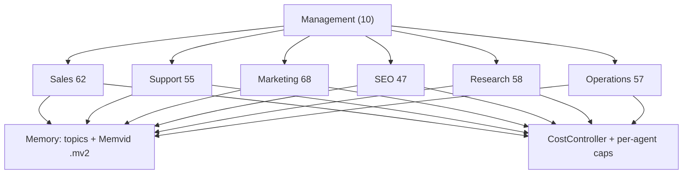

<p align="center">
  
</p>

# TechTide Swarm 357

[](https://pypi.org/project/techtide-swarm/)
[](https://github.com/TechTideOhio/swarm-357/actions/workflows/ci.yml)
[](https://pypi.org/project/techtide-swarm/)
[](LICENSE)

**A Python multi-agent orchestration framework for Claude agents.** Swarm 357 is an agent runtime organised as a 357-role catalog across 6 business layers, with portable agent memory, enforced LLM cost control, human-in-the-loop approvals on shell commands, and durable checkpoints you can resume, cancel, and replay.

It is an organisational ontology for AI agents, not 357 models running at once. Roles are the unit of design; the runtime decides which ones actually execute.

**[Live site](https://swarm357.techtideai.io)** · **[Documentation](https://swarm357.techtideai.io/docs)** · **[Blog](https://swarm357.techtideai.io/blog)** · **[PyPI](https://pypi.org/project/techtide-swarm/)** · **[Maturity matrix](STATUS.md)** · **[Security model](SECURITY.md)** · **[Landing repo](https://github.com/TechTideOhio/swarm-357-site)**

<p align="center">
  
</p>



## Contents

- [Install](#install)
- [Container image](#container-image)
- [About](#about)
- [What 357 agents means](#what-357-agents-means)
- [What this does](#what-this-does)
- [Architecture](#architecture)
- [Tech stack](#tech-stack)
- [Request lifecycle](#request-lifecycle)
- [Key differentiators](#key-differentiators)
- [Evals](#evals)
- [Feature maturity](#feature-maturity)
- [Why not another framework](#why-not-another-framework)
- [HTTP API](#http-api)
- [Memvid bridge](#memvid-bridge)
- [Development](#development)
- [Continuous integration](#continuous-integration)
- [Landing site and design](#landing-site-and-design)
- [Engineering writing](#engineering-writing)
- [Required environment](#required-environment)
- [Deployment](#deployment)
- [Releases](#releases)
- [License](#license)

## Install

```bash
pip install techtide-swarm
swarm demo
```

From this repository, editable with test dependencies:

```bash
pip install -e "packages/techtide-swarm[dev]"
swarm demo
```

`swarm demo` works with or without an API key. Without a key it prints an architecture overview and an explicitly labeled stub. With `ANTHROPIC_API_KEY` or an OpenRouter key it runs a live agent. There is no silent success path.

**Documentation:** https://swarm357.techtideai.io/docs covers guides, the API reference, evals, the changelog, and the full roster.

## Container image

The HTTP API is published to GitHub Container Registry for `linux/amd64` and `linux/arm64`.

```bash
docker run --rm -p 8000:8000 \
  -e ANTHROPIC_API_KEY=sk-ant-... \
  ghcr.io/techtideohio/swarm-357:latest
curl http://127.0.0.1:8000/api/health
```

| Tag | Points at |
|-----|-----------|
| `latest` | Most recent version tag |
| `0.2.2`, `0.2` | Exact and minor version series |
| `edge` | Current `main`, rebuilt on every push |
| `sha-<commit>` | A specific commit |

Images carry build provenance attestations, verifiable with the GitHub CLI:

```bash
gh attestation verify oci://ghcr.io/techtideohio/swarm-357:latest \
  --repo TechTideOhio/swarm-357
```

Set `SWARM_API_KEY` and `SWARM_REQUIRE_AUTH=1` before exposing the container beyond localhost. See [Required environment](#required-environment).

## About

Swarm 357 is an organizational ontology for agents. It is not a claim that 357 Opus sessions run in parallel. Each role is a YAML identity plus a soul template, for example `sales-outreach-specialist-015`, materialized at runtime by the Conductor. Layer execution uses bounded concurrency with a hard agent cap, so a task that touches six layers does not turn into an unbounded fan-out.

The design starts from the parts that break agent demos once real money and real filesystems are involved. Budgets are enforced per agent and per layer, with a logged downgrade rather than a silent one. Bash is policy-gated and denied outright in server and production modes unless explicitly enabled. Memory is a file you can copy, inspect, and verify rather than a managed service you rent. Runs checkpoint to SQLite so `inspect`, `resume`, `cancel`, `replay`, and `fork` mean something after a process dies.

Built by [TechTide AI](https://techtide.ai) for Claude Code native workflows, and used on the studio's own production automation before anything ships here. The runtime is open core under Apache-2.0. The product surface lives in a separate repository, [TechTideOhio/swarm-357-site](https://github.com/TechTideOhio/swarm-357-site), so the two release on independent trains. A longer version of this section, with linked stack and eval evidence, is published at [swarm357.techtideai.io/about](https://swarm357.techtideai.io/about).

## What 357 agents means

357 agents means 357 distinct agent identities, defined by the YAML roster and soul templates, materialized at runtime. It is not 357 simultaneous long-running model sessions. Objective checks live in [docs/VERIFY.md](docs/VERIFY.md) and in `python scripts/generate_roster.py --compact --fix-counts`.

## What this does

| Command | Behavior |
|---------|----------|
| `swarm run <task>` | Conductor selects roles across layers and reports real cost and latency |
| `swarm boot` | Loads the 357-agent roster, validates souls, prints layer budgets |
| `swarm agent --list` | Lists agents; `swarm agent <name> --run "task"` runs one |
| `swarm dream` | Memory consolidation for contradictions and duplicates, with optional model notes |
| `swarm plan <task>` | Deep planning through Opus-class models |
| `swarm eval` | 25-task catalog with an LLM judge, a $5 cap, and baseline regression |
| `swarm status`, `swarm cost` | Layer health and spend from local telemetry |
| `swarm serve` | FastAPI HTTP surface for the landing console |

## Architecture

| Component | Location | What it does |
|-----------|----------|-------------|
| Python package | [`packages/techtide-swarm/`](packages/techtide-swarm/) | `Agent`, `Swarm`, `CostController`, `MemoryManager`, `BashSecurityGate`, CLI, HTTP API |
| Memvid bridge (Rust) | [`packages/memvid-swarm-bridge/`](packages/memvid-swarm-bridge/) | CLI binary for `.mv2` create, put, search, and verify |
| Agent roster | [`config/swarm-compact.yaml`](config/swarm-compact.yaml) | Compact 357-agent expansion, also bundled in the wheel |
| Soul templates | [`templates/soul/`](templates/soul/) | Personality files with YAML front matter and system prompts |
| Eval harness | [`evals/`](evals/) | 25-task benchmark, LLM judge, baselines |
| Landing page | [TechTideOhio/swarm-357-site](https://github.com/TechTideOhio/swarm-357-site) | Next.js 16 product surface, separate public repository |
| Memvid core | [memvid/memvid](https://github.com/memvid/memvid), [crates.io/memvid-core](https://crates.io/crates/memvid-core) | Upstream Rust library used by the bridge |

## Tech stack

| Layer | Technology | Role |
|-------|-----------|------|
| Language | [Python 3.10+](https://www.python.org/downloads/) | Package, CLI, and server |
| Validation | [Pydantic v2](https://docs.pydantic.dev/) | `AgentConfig`, payloads, and roster schemas |
| HTTP | [FastAPI](https://fastapi.tiangolo.com/) with [Uvicorn](https://www.uvicorn.org/) | `swarm serve`, SSE event stream |
| Persistence | [SQLite](https://www.sqlite.org/docs.html) | Durable run checkpoints for inspect, resume, and fork |
| Memory | [memvid-core](https://crates.io/crates/memvid-core) via a [Rust](https://www.rust-lang.org/) bridge | Single-file `.mv2` stores with WAL, lexical and vector indexes |
| Models | [Anthropic Claude](https://docs.anthropic.com/), optionally [OpenRouter](https://openrouter.ai/docs) | Default provider and the provider used for eval baselines |
| Tracing | Local JSONL, optional [OpenTelemetry](https://opentelemetry.io/docs/) export | `.swarm/traces.jsonl`, enabled with `SWARM_OTEL_EXPORT=1` |
| Quality | [ruff](https://docs.astral.sh/ruff/), [mypy](https://mypy.readthedocs.io/), [pytest](https://docs.pytest.org/) | Lint, strict typing, tests with a coverage floor |
| Packaging | [Hatchling](https://hatch.pypa.io/latest/) to [PyPI](https://pypi.org/project/techtide-swarm/) | Wheel and source distribution with attestations |
| Runtime images | [Docker](https://docs.docker.com/) on [Railway](https://docs.railway.com/) | Backend service with a health check |
| Product surface | [Next.js 16](https://nextjs.org/docs) in [swarm-357-site](https://github.com/TechTideOhio/swarm-357-site) | Landing page and documentation library |

## Request lifecycle


## Key differentiators

**Portable `.mv2` memory.** Single-file Memvid stores with WAL crash safety, full-text and vector search, and integrity verification. No database server required.

**Business-layer ontology.** Six domain layers plus management meta-agents model a real org chart rather than an ad-hoc agent graph.

**Layered cost controls.** Per-agent budget caps during `Agent.run()`, per-layer daily limits, and an explicit logged downgrade to Haiku at 80 percent layer utilization, emitted as `model_downgrade` telemetry. This is separate from provider mapping: opus and sonnet are never silently remapped to Haiku unless `SWARM_OPENROUTER_CHEAP=1`.

**BashSecurityGate.** A 13-pattern validator on the `Bash` tool that blocks destructive commands and secret exfiltration, covered by 33 scenario cases. It is pattern based, not an operating system sandbox, and the documentation says so.

**Tool-call resilience.** `input_normalize` coerces common model argument aliases, such as `file_path` to `path`, so runs do not die on schema drift.

## Evals

Numbers come from [`evals/baselines/latest.json`](evals/baselines/latest.json) through [`scripts/render_eval_assets.py`](scripts/render_eval_assets.py). Full write-up: [docs/EVALS.md](docs/EVALS.md) and the hosted [eval methodology](https://swarm357.techtideai.io/docs/evals/methodology) page.


| Metric | Value |
|--------|------:|
| Catalog | 25 tasks (20 single, 5 swarm) |
| Executions including burns | 154 |
| Passed gates | 145 |
| Avg combined score | 0.923 |
| Spend | $4.9915 / $5.00 |
| Provider | `openrouter` |
| Agent model | `anthropic/claude-sonnet-4` |
| Single-agent pass | 142/142 |
| Swarm pass | 4/12 |

Swarm pipeline runs can hit 150 to 180 second wall-clock timeouts on OpenRouter, which is why the swarm number is low and reported separately. Single-agent with tools is the production demo path. Scoring combines a keyword gate with an optional Haiku judge at `0.55 * keyword + 0.45 * judge`, under a hard $5 budget, with checkpoint and resume plus regression compare.

```bash
python -u evals/run_evals.py --budget 5.0 --save-baseline --compare
# or
swarm eval --save-baseline --compare
```

Do not hand-edit these figures. Regenerate them with `python scripts/render_eval_assets.py` after a new baseline lands.

## Feature maturity

[STATUS.md](STATUS.md) is the source of truth. Summary for 0.2.2:

| Feature | Status |
|---------|--------|
| Agent and Swarm orchestration | Beta |
| CLI | Stable and Beta |
| Memory (flat file) | Stable |
| Memvid `.mv2` via bridge | Beta |
| BashSecurityGate | Stable |
| Bash HITL approvals | Beta |
| SSE with auth and terminal close | Beta |
| Cost controls | Beta |
| Eval harness | Beta |
| HTTP API | Beta |
| Dream cycle | Experimental |
| Opik cloud | Not implemented |

Reviewer checklist: [docs/VERIFY.md](docs/VERIFY.md), [SECURITY.md](SECURITY.md), [CLAUDE.md](CLAUDE.md).

## Why not another framework

| Framework | Swarm 357 advantage | Their advantage |
|-----------|--------------------|--------------------|
| LangGraph | Portable `.mv2` memory, business-layer ontology, cost gates, real Bash HITL or none | Durable checkpointing, larger ecosystem |
| OpenClaw and local-first tools | Fail-closed auth, workspace filesystem confinement, legible status and verification docs | Broader desktop agent surface |
| CrewAI | Enforced cost controls, security gate, layered architecture | Faster time to first value, YAML crew config |
| OpenAI Agents SDK | Multi-agent orchestration, memory persistence | Input and output guardrails, simpler API surface |

Longer comparison: [docs/COMPARISON.md](docs/COMPARISON.md).

## HTTP API

`uvicorn techtide_swarm.server:app` exposes public GET routes such as `/api/health` and `/api/swarm/agents`. POST routes require `X-SWARM-API-KEY` whenever `SWARM_API_KEY` is set, and auth fails closed in production. Tune `SWARM_MAX_RUN_BUDGET_USD` and `SWARM_RATE_LIMIT_PER_MINUTE`. See [.env.example](.env.example).

## Memvid bridge

```bash
cd packages/memvid-swarm-bridge && cargo build --release
export MEMVID_SWARM_BRIDGE="$(pwd)/target/release/memvid-swarm-bridge"
```

See [docs/MEMVID_BRIDGE.md](docs/MEMVID_BRIDGE.md).

## Development

```bash
make install    # editable install plus dev dependencies
make test       # pytest
make lint       # ruff check
make typecheck  # mypy strict
make all        # install, lint, typecheck, test
```

See [CONTRIBUTING.md](CONTRIBUTING.md). Roadmap: [ROADMAP.md](ROADMAP.md). Release process: [RELEASE.md](RELEASE.md).

## Continuous integration

GitHub Actions: [`.github/workflows/ci.yml`](.github/workflows/ci.yml)

| Job | Checks |
|-----|--------|
| `python` | Python 3.10 through 3.13, ruff, mypy, pytest with coverage, clean-wheel boot smoke |
| `roster` | 357-agent counts and Support souls packaged |
| `build-package` | Wheel and source distribution artifacts |
| `rust-bridge` | fmt, clippy, build, bridge integration tests |
| `docker` | Health reports `agents == 357`, and auth returns non-200 without a key |
| `docs-links` | Bans scrubbed path references |

Publishing runs from [`.github/workflows/publish.yml`](.github/workflows/publish.yml) on `v*` tags and produces attestations, a PyPI release, and a GitHub Release. Landing CI lives in [swarm-357-site](https://github.com/TechTideOhio/swarm-357-site).

## Landing site and design

Product marketing, the art carousel, and the try-it-live BFF live in [TechTideOhio/swarm-357-site](https://github.com/TechTideOhio/swarm-357-site), at landing 0.2.2 on the same release train.

| Surface | URL |
|---------|-----|
| Frontend | https://swarm357.techtideai.io |
| Backend API | https://swarm357be.up.railway.app |
| About and maturity mirror | https://swarm357.techtideai.io/about |
| Design system | https://swarm357.techtideai.io/docs/resources/design |

The design system is documented in the landing repository and summarized for this repository in [docs/DESIGN.md](docs/DESIGN.md), which also lists the brand assets sourced here under `docs/assets/`.

## Engineering writing

Long-form notes on the decisions behind this runtime. Full index at [swarm357.techtideai.io/blog](https://swarm357.techtideai.io/blog), feed at [/feed.xml](https://swarm357.techtideai.io/feed.xml).

| Post | Covers |
|------|--------|
| [What an agent swarm actually means in production](https://swarm357.techtideai.io/blog/what-agent-swarm-means-in-production) | Definitions and the claims worth distrusting |
| [pip install techtide-swarm: your first run](https://swarm357.techtideai.io/blog/pip-install-techtide-swarm-first-run) | Install through `swarm demo` and the first live run |
| [Building a 357 role catalog for AI agents](https://swarm357.techtideai.io/blog/building-a-357-role-catalog) | Why roles are an ontology, not concurrent sessions |
| [Cost control for LLM agent fleets](https://swarm357.techtideai.io/blog/cost-control-for-llm-agent-fleets) | Per-agent caps, layer budgets, logged downgrades |
| [Why your agent needs a bash policy gate](https://swarm357.techtideai.io/blog/why-your-agent-needs-a-bash-policy-gate) | `BashSecurityGate` and what pattern matching cannot do |
| [Portable agent memory with Memvid](https://swarm357.techtideai.io/blog/portable-agent-memory-with-memvid) | `.mv2` stores through the Rust bridge |
| [Durable checkpoints: resume, cancel, replay, fork](https://swarm357.techtideai.io/blog/durable-checkpoints-resume-cancel-replay) | What survives a process dying mid-run |
| [Swarm 357 mid-year status](https://swarm357.techtideai.io/blog/swarm-357-mid-year-status) | Prose mirror of [STATUS.md](STATUS.md) |

## Required environment

```bash
ANTHROPIC_API_KEY=sk-ant-...    # or OPENROUTER_API_KEY
```

Optional: `SWARM_MODEL_*`, `MEMVID_SWARM_BRIDGE`, `SWARM_API_KEY`, and `ANTHROPIC_BASE_URL` for OpenRouter. The full list is in [packages/techtide-swarm/README.md](packages/techtide-swarm/README.md).

## Deployment

Railway runs two services:

| Service | Build | Root | Health |
|---------|-------|------|--------|
| `backend` | Dockerfile | `/` | `/api/health` |
| `frontend` | Nixpacks with Next.js 16 | [swarm-357-site](https://github.com/TechTideOhio/swarm-357-site) | `/` |

See [docs/DEPLOY_RAILWAY.md](docs/DEPLOY_RAILWAY.md).

## Releases

Current version is 0.2.2, which closes the remaining critique gaps from 0.2.1: real Bash HITL, SSE auth with `stream.end`, durable cancel, a gold `CLAUDE.md`, and CI security gates. Full history, including the 0.2.1 correction, is in [CHANGELOG.md](CHANGELOG.md). The cut, protect, and publish procedure is in [RELEASE.md](RELEASE.md).

## License

Apache-2.0. See [LICENSE](LICENSE).
